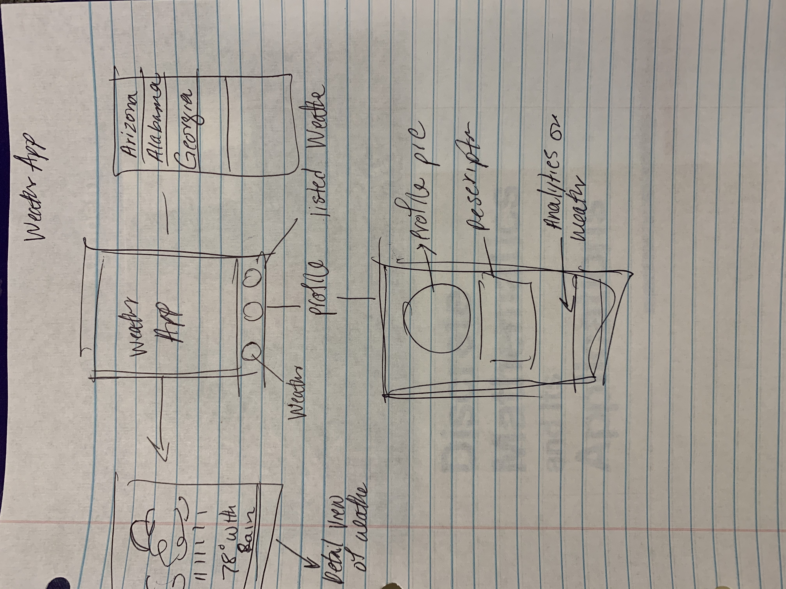
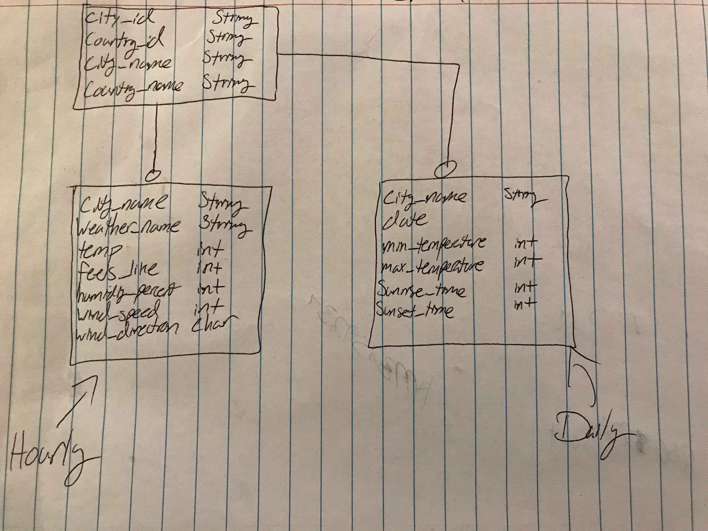

Unit 9: Group Milestone - README
===

# TUNIN

## Table of Contents
1. [Overview](#Overview)
2. [Product Spec](#Product-Spec)
3. [Wireframes](#Wireframes)
4. [Schema](#Schema)

## Overview
### Description
Weather Social App. For people who love weather.

### App Evaluation
- **Category:** Social Networking / Weather
- **Mobile:** This app would be primarily developed for mobile but would perhaps be just as viable on a computer, such as tinder or other similar apps. Functionality wouldn't be limited to mobile devices, however mobile version could potentially have more features.
- **Story:** Analyzes users music choices, and connects them to other users with similar choices. The user can then decide to message this person and befriend them if wanted.
- **Market:** Any individual could choose to use this app, and to keep it a safe environment, people would be organized into age groups.
- **Habit:** This app could be used as often or unoften as the user wanted depending on how deep their social life is, and what exactly they're looking for.
- **Scope:** First we would start with pairing people based on music taste, then perhaps this could evolve into a music sharing application as well to broaden its usage. Large potential for use with spotify, apple music, or other music streaming applications.

## Product Spec
### 1. User Stories (Required and Optional)

**Required Must-have Stories**

* User logs in to access previous chats and preference settings
* User picks location for weather
* Matches have a chat window to get to know each other and weather
* Profile pages for each user
* Settings (Accesibility, Notification, General, etc.)

**Optional Nice-to-have Stories**

* Log of weather patterns
* Page of weather 
* Profile Add-On: Profiles
* Optional Shuffle Button (i.e. random encounter/random song)
* Listening/Encounter Queue

### 2. Screen Archetypes

* Login 
* Register - User signs up or logs into their account
   * Upon Download/Reopening of the application, the user is prompted to log in to gain access to their profile information to be properly matched with another person. 
   * ...
* Messaging Screen - Chat for users to communicate (direct 1-on-1)
   * Upon selecting music choice users matched and message screen opens
* Profile Screen 
   * Allows user to upload a photo and fill in information that is interesting to them and others
* Song Selection Screen.
   * Allows user to be able to choose their desired song, artist, genre of preference and begin listening and interacting with others.
* Settings Screen
   * Lets people change language, and app notification settings.

### 3. Navigation

**Tab Navigation** (Tab to Screen)

* Weather selection
* Profile
* Settings

Optional:

**Flow Navigation** (Screen to Screen)
* Forced Log-in -> Account creation if no log in is available
* Weather Selection (Or Queue if Optional) -> Jumps to Chat
* Profile -> Text field to be modified. 
* Settings -> Toggle settings

## Wireframes
 

### 4. Schema
 

GET - Current Data
https://rapidapi.com/community/api/open-weather-map/endpoints

CODE SNIPPETS
CURRENT WEATHER DATA 

OkHttpClient client = new OkHttpClient();

Request request = new Request.Builder()
	.url("https://community-open-weather-map.p.rapidapi.com/weather?lat=0&lon=0&callback=test&id=2172797&lang=null&units=%2522metric%2522%20or%20%2522imperial%2522&mode=xml%252C%20html&q=London%252Cuk")
	.get()
	.addHeader("x-rapidapi-host", "community-open-weather-map.p.rapidapi.com")
	.addHeader("x-rapidapi-key", "70f8dbd6c0msh7528b257dafdcefp149a83jsn596a362a211d")
	.build();

Response response = client.newCall(request).execute();

